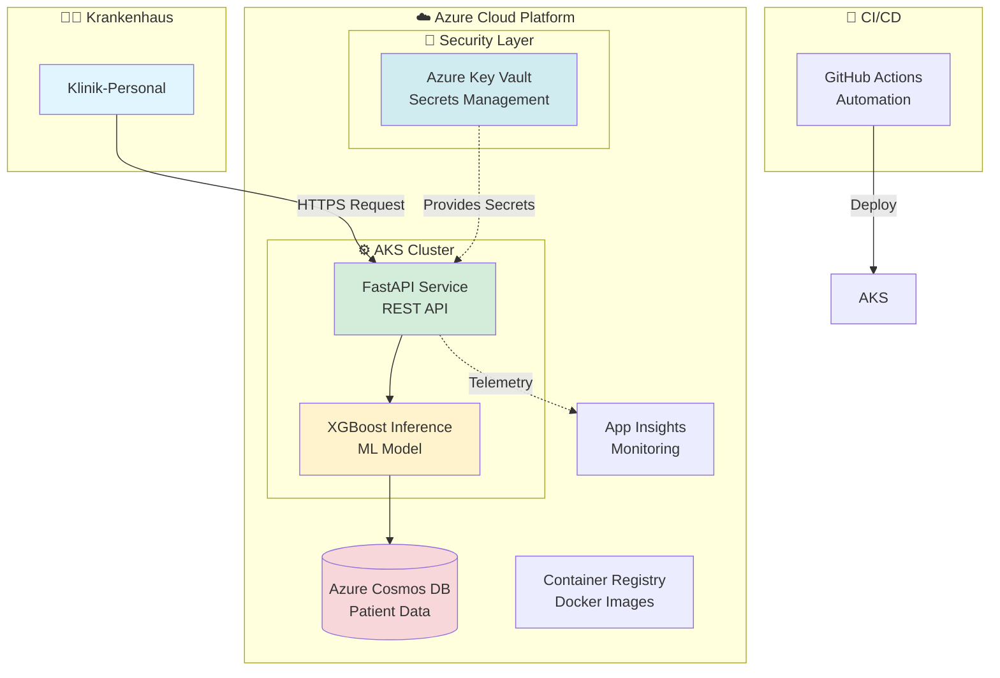
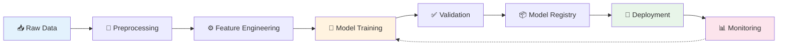
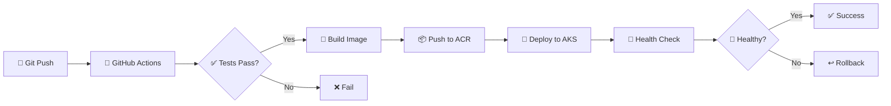

<div align="center">

# 🏥 Sepsis-Früherkennung durch Cloud MLOps

### Machine Learning trifft lebensrettende Medizin

[](https://www.python.org/)
[](https://azure.microsoft.com/)
[](https://www.docker.com/)
[](https://kubernetes.io/)

**Masterarbeit** · Mustafa Demir · Januar - Mai 2026

[📖 Dokumentation](#-über-das-projekt) · [🚀 Quick Start](#-schnellstart) · [🔬 Forschung](#-forschungsfragen) · [� Learning Path](#-learning-path) · [�💬 Kontakt](#-kontakt)

</div>

---

## 💡 Über das Projekt

Sepsis ist eine lebensbedrohliche Erkrankung, die jährlich Millionen von Menschen weltweit betrifft. Jede Stunde zählt – und genau hier setzt dieses Projekt an.

Ich entwickle eine **Cloud-basierte MLOps-Plattform**, die mithilfe von Machine Learning das Sepsis-Risiko **6-12 Stunden im Voraus** vorhersagen kann. Das Ziel: medizinisches Personal frühzeitig warnen und Leben retten.

### 🎯 Was macht dieses Projekt besonders?

<table>
<tr>
<td width="33%" valign="top">

#### 🏥 Medizinischer Impact
Frühwarnsystem, das kritische Zeitfenster für Interventionen öffnet – bevor klinische Symptome auftreten.

</td>
<td width="33%" valign="top">

#### ⚡ Technische Exzellenz
Production-ready Cloud-Architektur auf Azure mit automatisierter CI/CD, Monitoring und Skalierung.

</td>
<td width="33%" valign="top">

#### 📚 Akademischer Beitrag
Evaluation von MLOps Best Practices in stark regulierten Healthcare-Umgebungen.

</td>
</tr>
</table>

### 🔬 Forschungsfragen

Diese Arbeit beantwortet drei zentrale Fragen:

> **1. Performance & Latency**  
> Wie kann eine Cloud-native Architektur Echtzeit-Vorhersagen mit minimaler Latenz gewährleisten?

> **2. Compliance & Regulierung**  
> Wie lassen sich automatisierte MLOps-Workflows mit DSGVO und MDR vereinbaren?

> **3. Model Drift & Retraining**  
> Welche Strategien sind effektiv, um klinische Modelle kontinuierlich aktuell zu halten?

---

## 🏗️ System-Architektur

Die Plattform nutzt moderne Cloud-native Patterns für Skalierbarkeit, Sicherheit und Verfügbarkeit:



### 🔄 Datenfluss

1. **Eingabe**: Klinik-Personal sendet Patientenvitaldaten über die API
2. **Verarbeitung**: Feature Engineering & Normalisierung
3. **Vorhersage**: XGBoost-Modell berechnet Sepsis-Risiko
4. **Speicherung**: Ergebnisse werden in Azure Cosmos DB persistiert
5. **Monitoring**: Alle Metriken fließen in App Insights

---

## 🛠️ Technologie-Stack

<table>
<tr>
<td width="50%">

### 🤖 Machine Learning
- **Training**: Scikit-Learn, XGBoost
- **Tracking**: MLflow
- **Feature Store**: Azure ML

### 🌐 Backend & API
- **Framework**: FastAPI
- **Server**: Uvicorn (ASGI)
- **Validation**: Pydantic

### 💾 Datenbank & Storage
- **Database**: Azure Cosmos DB (NoSQL)
- **Blob Storage**: Azure Storage
- **Cache**: Redis

</td>
<td width="50%">

### 🐳 Container & Orchestrierung
- **Containerization**: Docker
- **Registry**: Azure Container Registry
- **Orchestration**: Azure Kubernetes Service (AKS)

### 🔧 Infrastructure & DevOps
- **IaC**: Bicep, Terraform
- **CI/CD**: GitHub Actions
- **Monitoring**: Azure Monitor, App Insights

### 🔐 Security & Compliance
- **Secrets**: Azure Key Vault
- **Auth**: Azure AD / Managed Identity
- **Encryption**: TLS 1.3, TDE

</td>
</tr>
</table>

---

## 📁 Projektstruktur

Die Codebasis folgt Best Practices für Production-ML-Systeme:

```
Masterarbeit-Cloud-MLOps/
│
├── 📊 data/                    # Datenverwaltung
│   ├── raw/                    # Originaldaten (MIMIC-III)
│   ├── processed/              # Bereinigte & transformierte Daten
│   └── synthetic/              # Synthetische Test-Daten
│
├── 🐍 src/                     # Produktionscode
│   ├── data/                   # ETL & Data Processing
│   ├── models/                 # ML Training & Inference
│   ├── api/                    # FastAPI Application
│   └── monitoring/             # Observability & Logging
│
├── 🧪 tests/                   # Test-Suite
│   ├── unit/                   # Unit Tests
│   └── integration/            # Integration Tests
│
├── 🐳 docker/                  # Container Definitions
│   ├── api.Dockerfile          # API Service
│   └── training.Dockerfile     # Training Pipeline
│
├── ☁️ infrastructure/          # Infrastructure as Code
│   ├── bicep/                  # Azure Bicep Templates
│   ├── terraform/              # Terraform Configs
│   └── kubernetes/             # K8s Manifests
│
├── 🔄 .github/workflows/       # CI/CD Pipelines
│   ├── ci.yml                  # Continuous Integration
│   ├── cd.yml                  # Continuous Deployment
│   └── model-training.yml      # Automated Retraining
│
├── 📜 scripts/                 # Utility Scripts
│   ├── setup.sh                # Environment Setup
│   └── deploy.sh               # Deployment Helper
│
├── ⚙️ config/                  # Konfigurationsdateien
│   ├── model_config.yaml       # ML Hyperparameter
│   └── deployment_config.yaml  # Cloud Resources
│
├── 📝 logs/                    # Application Logs
├── 🤖 models/                  # Trainierte Modelle
│
└── 📋 Configuration Files
    ├── .env.example            # Umgebungsvariablen Template
    ├── .gitignore              # Git Ignore Rules
    ├── requirements.txt        # Python Dependencies
    └── README.md               # Diese Datei
```

---

## 🚀 Schnellstart

### Voraussetzungen

- Python 3.9 oder höher
- Docker & Docker Compose
- Azure CLI (für Cloud-Deployment)
- Git

### 🔧 Lokale Entwicklungsumgebung

**1. Repository klonen**
```bash
git clone https://github.com/MustDemir/Masterarbeit-Cloud-MLOps.git
cd Masterarbeit-Cloud-MLOps
```

**2. Virtuelle Umgebung erstellen**
```bash
python3 -m venv venv
source venv/bin/activate  # Windows: venv\Scripts\activate
```

**3. Dependencies installieren**
```bash
pip install -r requirements.txt
```

**4. Umgebungsvariablen konfigurieren**
```bash
cp .env.example .env
# Öffne .env und füge deine Azure Credentials hinzu
```

**5. API lokal starten**
```bash
uvicorn src.api.main:app --reload --host 0.0.0.0 --port 8000
```

**6. Jupyter Notebooks verwenden**
```bash
# Alle Notebooks sind zentral unter ../Jupyter_Notebooks/ strukturiert
jupyter notebook ../Jupyter_Notebooks/
```

Die API ist nun verfügbar unter:
- 🌐 **API**: http://localhost:8000
- 📚 **Swagger Docs**: http://localhost:8000/docs
- 🔧 **ReDoc**: http://localhost:8000/redoc

### 🐳 Mit Docker

```bash
docker-compose up -d
```

### ☁️ Azure Deployment

```bash
# Azure Login
az login

# Infrastructure bereitstellen
cd infrastructure/bicep
az deployment group create \
  --resource-group sepsis-mlops-rg \
  --template-file main.bicep

# App deployen
./scripts/deploy.sh
```

---

## 📊 Datensatz & Features

### MIMIC-III Clinical Database

Das Projekt nutzt die **MIMIC-III Critical Care Database** – eine frei verfügbare Datenbank mit de-identifizierten Gesundheitsdaten von über 40.000 Intensivpatienten.

<details>
<summary><b>📋 Feature-Set (klicken zum Erweitern)</b></summary>

#### Vitaldaten
- 💓 **Herzfrequenz (HR)**: Schläge pro Minute
- 🌡️ **Körpertemperatur**: In °C
- 🩸 **Blutdruck (MAP)**: Mittlerer arterieller Druck
- 💨 **Atemfrequenz (RR)**: Atemzüge pro Minute
- 🩹 **SpO2**: Sauerstoffsättigung

#### Laborwerte
- 🧪 **Laktat**: Indikator für Gewebehypoxie
- 🔬 **Weiße Blutkörperchen (WBC)**
- 🩸 **Kreatinin**: Nierenfunktion
- 📊 **Bilirubin**: Leberfunktion

#### Abgeleitete Scores
- 📈 **SOFA Score**: Sequential Organ Failure Assessment
- ⚕️ **SIRS Kriterien**: Systemic Inflammatory Response

</details>

**Datenquellen:**
- [MIMIC-III auf PhysioNet](https://physionet.org/content/mimiciii/)
- Zusätzlich: Synthetische Testdaten für CI/CD Pipelines

---

## 🧪 Machine Learning Pipeline

### Workflow-Übersicht



### Pipeline-Stages

#### 1️⃣ **Data Preprocessing**
- Imputation fehlender Werte (KNN-Imputer)
- Outlier-Detection mit IQR-Methode
- Normalisierung (StandardScaler)
- Handling von Klassenungleichgewicht (SMOTE)

#### 2️⃣ **Feature Engineering**
```python
# Beispiel: SOFA-Score Berechnung
def calculate_sofa_score(vitals):
    """Sequential Organ Failure Assessment"""
    score = 0
    score += respiratory_score(vitals['pao2_fio2'])
    score += cardiovascular_score(vitals['map'], vitals['vasopressors'])
    score += hepatic_score(vitals['bilirubin'])
    score += renal_score(vitals['creatinine'])
    return score
```

#### 3️⃣ **Model Training**
- **Algorithmus**: XGBoost (Gradient Boosting)
- **Hyperparameter-Tuning**: Optuna (Bayesian Optimization)
- **Cross-Validation**: 5-Fold Stratified CV
- **Metriken**: AUROC, Precision, Recall, F1-Score

#### 4️⃣ **Model Monitoring**
- **Data Drift Detection**: Kolmogorov-Smirnov Test
- **Performance Tracking**: MLflow
- **Alerting**: Bei Accuracy-Drop > 5%
- **Auto-Retraining**: Wöchentlich via GitHub Actions

---

## 🔒 Security & Compliance

### 🛡️ Sicherheitsmaßnahmen

<table>
<tr>
<td width="50%">

#### Datenschutz (DSGVO-konform)
- ✅ Pseudonymisierung aller Patientendaten
- ✅ Keine Speicherung personenbezogener Daten
- ✅ Audit-Logs für alle Datenzugriffe
- ✅ Right to be forgotten (Daten-Löschung)

#### Verschlüsselung
- 🔐 **At-Rest**: Azure Storage Encryption (256-bit AES)
- 🔐 **In-Transit**: TLS 1.3
- 🔐 **Database**: Transparent Data Encryption (TDE)

</td>
<td width="50%">

#### Zugriffskontrolle
- 🔑 Azure Active Directory Integration
- 🔑 Role-Based Access Control (RBAC)
- 🔑 Managed Identities (kein Secret-Handling im Code)
- 🔑 Azure Key Vault für alle Secrets

#### Compliance
- 📋 DSGVO / GDPR
- 📋 HIPAA-ready Architecture
- 📋 ISO 27001 Best Practices
- 📋 MDR (Medical Device Regulation) konform

</td>
</tr>
</table>

### 🔍 Audit & Logging

Alle API-Anfragen werden geloggt:
```json
{
  "timestamp": "2026-01-26T10:30:00Z",
  "user_id": "hash_12345",
  "action": "predict",
  "patient_id": "pseudonym_abc",
  "result": "low_risk",
  "latency_ms": 45
}
```

---

## � Monitoring & Observability

Die Plattform nutzt das **Three Pillars of Observability** Pattern:

### 📊 Metriken (Metrics)
- **Business Metrics**: Prediction Count, Sepsis Detection Rate
- **System Metrics**: API Latency, CPU/Memory Usage, Request Rate
- **ML Metrics**: Model Accuracy, Prediction Confidence, Feature Drift

### 📝 Logging
- Strukturierte JSON-Logs
- Zentralisierung via Azure Log Analytics
- Retention: 90 Tage

### 🔍 Distributed Tracing
- End-to-End Request Tracking mit Application Insights
- Latenz-Analyse für jeden Pipeline-Step

### 🚨 Alerting

| Alert | Schwellwert | Aktion |
|-------|-------------|--------|
| Model Accuracy Drop | < 85% | Auto-Retraining |
| API Latency | > 500ms | Scale-Up |
| Error Rate | > 1% | PagerDuty Alert |
| Data Drift | KS-Test p < 0.05 | Daten-Review |

---

## 🧪 Testing

```bash
# Unit Tests
pytest tests/unit/ -v --cov=src

# Integration Tests
pytest tests/integration/ -v

# E2E Tests
docker-compose -f docker-compose.test.yml up --abort-on-container-exit
```

**Test Coverage Ziel**: > 80%

---

## 🚢 CI/CD Pipeline



### Deployment Environments

| Environment | Trigger | Strategy |
|-------------|---------|----------|
| **Development** | Push to `dev` | Auto-deploy |
| **Staging** | PR to `main` | Auto-deploy |
| **Production** | Manual Approval | Blue/Green Deployment |

---

## �📚 Zitierung

Falls dieses Projekt für akademische Zwecke genutzt wird, bitte wie folgt zitieren:

```bibtex
@mastersthesis{demir2026sepsis,
  author = {Mustafa Demir},
  title = {Cloud-basierte prädiktive Analytik für Sepsis-Früherkennung},
  school = {Deine Hochschule},
  year = {2026},
  url = {https://github.com/MustDemir/Masterarbeit-Cloud-MLOps}
}
```

---

## 🤝 Kontakt & Support

<div align="center">

### Mustafa Demir

📧 **Email**: [mu.demir@icloud.com](mailto:mu.demir@icloud.com)  
🐙 **GitHub**: [@MustDemir](https://github.com/MustDemir)  
💼 **LinkedIn**: [Profil anzeigen](#)

---

### 💬 Feedback & Fragen?

Ich freue mich über:
🐛 **Bug Reports** via [GitHub Issues](https://github.com/MustDemir/Masterarbeit-Cloud-MLOps/issues)
💡 **Feature Requests** & Verbesserungsvorschläge
⭐ **Stars**, wenn dir das Projekt gefällt!
🤝 **Contributions** sind herzlich willkommen

---

### 📊 Projekt-Status


| Phase | Status | Zeitraum |
|-------|--------|----------|
| 📋 Konzeption | ✅ Abgeschlossen | Jan 2026 |
| 🏗️ Setup & Infrastruktur | 🔄 In Arbeit | Jan - Feb 2026 |
| 🤖 ML-Pipeline | ⏳ Geplant | Feb - Mär 2026 |
| ☁️ Cloud-Deployment | ⏳ Geplant | Mär - Apr 2026 |
| 📊 Evaluation | ⏳ Geplant | Apr - Mai 2026 |
| 📝 Thesis-Schreiben | 🔄 Laufend | Jan - Mai 2026 |

---

## 📚 Learning Path

Dieses Projekt integriert **IBM Python for Data Science, AI & Development** Kurs-Skills mit produktiver Cloud-Entwicklung:

### 🎓 Kurs-Modul Mapping

| Woche | Kurs-Modul | Thema | Anwendung im Projekt |
|-------|-----------|-------|----------------------|
| **1-2** | Modul 1-2 | Python Basics & Data Structures | Patient Records, Datentyp-Handling |
| **3** | Modul 3 | Programming & OOP | ML Pipeline Classes, Exception Handling |
| **4** | Modul 4 | Data Processing | Pandas/NumPy Feature Engineering |
| **5** | Modul 5 | APIs & Integration | REST API für Model Serving |
| **6** | - | Cloud Deployment | Azure MLOps Integration |

### 📖 Learning Documentation

Mein persönlicher **Learning Log** dokumentiert Erkenntnisse, Challenges und Code-Beispiele während des gesamten Projekts:

👉 **[📓 Vollständiger Learning Log →](docs/learning_log.md)**

### 🌳 Branch-Strategie für kontinuierliches Lernen

```
main (Stable Release)
  ↑
develop (Integration Branch)
  ↑
├── feature/python-basics (Woche 1-2) ← AKTUELL
├── feature/ml-pipeline (Woche 3)
├── feature/data-processing (Woche 4)
└── feature/api-integration (Woche 5)
```

**Workflow:**
- 🏷️ Jede Woche ein neuer Feature-Branch
- 📝 Lernfortschritt in `docs/learning_log.md`
- 🔀 Wöchentliches Merging in `develop`
- ✅ Finale Integration in `main` (Ende Mai 2026)

---

### 🌟 Support this Project

Wenn dieses Projekt für deine Forschung oder Arbeit nützlich ist:

- ⭐ **Gib dem Repo einen Stern**
- 📢 **Teile es** mit anderen
- 📖 **Zitiere es** in deinen Publikationen

---

<sub>**Letzte Aktualisierung**: 26. Januar 2026 · **Version**: 0.1.0-alpha</sub>

</div>
