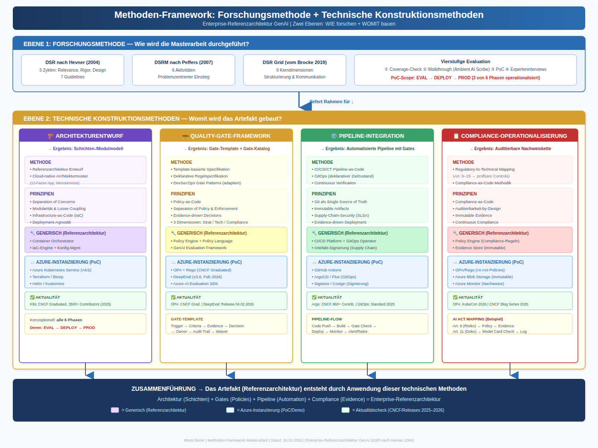
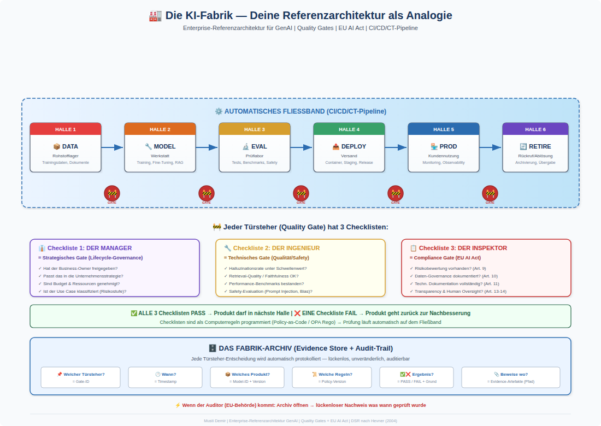
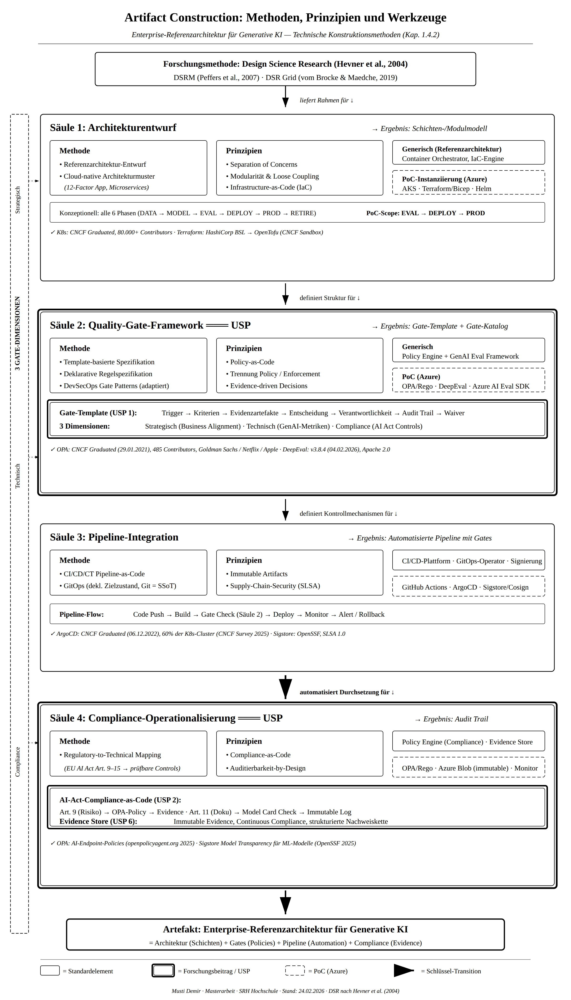

# Enterprise-Referenzarchitektur fuer Generative KI

**Cloud-native GenAIOps und automatisierte Quality Gates im Kontext des EU AI Act**

Masterarbeit | Mustafa Demir | SRH Fernhochschule | 2026

---

## What I Built (Portfolio Snapshot)

- Designed a cloud-native GenAIOps reference architecture aligned with EU AI Act requirements.
- Structured the thesis workspace into an end-to-end chapter system (01-08) with traceable artifacts.
- Implemented quality-gate artifacts (strategic, technical, compliance) and requirement traceability.
- Built a reproducible session workflow (`save.py`, `reindex.py`, `resume.py`) for compact AI context continuity.
- Separated cloud artifact storage by container to keep thesis and toolkit contexts clean and auditable.

## Problemstellung

Generative KI-Systeme (LLMs, RAG-Architekturen) stellen Unternehmen vor drei ungeloeste Herausforderungen:

| # | Problemdimension | Kern |
|---|---|---|
| PD1 | **Lifecycle-Fragmentierung** | Bestehende MLOps/LLMOps-Frameworks adressieren isolierte Phasen ohne integrierte End-to-End-Governance |
| PD2 | **Qualitaetssicherungsluecke** | Deterministische Metriken (Accuracy, F1) versagen bei stochastischen GenAI-Outputs -- keine standardisierten Evaluationsmetriken, unzureichende Observability, fehlende phasenuebergreifende Orchestrierung |
| PD3 | **Compliance-Operationalisierungsluecke** | EU AI Act Art. 9-15 definieren Pflichten, aber keine technische Uebersetzung in maschinenpruefbare Controls existiert |

Diese Arbeit schliesst die Luecke durch eine **Enterprise-Referenzarchitektur**, die GenAIOps-Praktiken mit automatisierten Quality Gates verbindet und EU-AI-Act-Anforderungen als pruefbare Kontrollmechanismen in CI/CD/CT-Pipelines operationalisiert.

## Forschungsfragen

- **RQ1 (Relevance):** Welche normativen Anforderungen sind fuer eine verantwortungsnachweisbare Gestaltung von GenAI-Systemen im Enterprise-Kontext relevant und technisch operationalisierbar?
- **RQ2 (Design):** Wie kann eine Referenzarchitektur fuer GenAIOps gestaltet werden, die diese normativen Anforderungen durch ein lifecycle-integriertes Quality-Gate-Kontrollsystem systematisch operationalisiert?
- **RQ3 (Rigor):** Inwiefern ermoeglicht die entwickelte Referenzarchitektur die technische Durchsetzung und Nachweisbarkeit dieser Anforderungen in einem cloud-nativen GenAIOps-Kontext?

## Architektur-Dokumente (Source of Truth)

Statt einer statischen README-Grafik sind hier die verbindlichen Quellen verlinkt:

- [Aktuelle Gliederung v3](00_admin/gliederung_v3.md)
- [Architektur-Kapitel (RQ2)](05_referenzarchitektur_RQ2/)
- [Quality-Gate-Artefakte](05_referenzarchitektur_RQ2/05_03_quality_gates/)
- [Pipeline-Integration](05_referenzarchitektur_RQ2/05_04_pipelines_integration/)
- [Evaluation (RQ3)](06_evaluation_RQ3/)
- [Expose v3 SINGLE SOURCE (PDF)](docs/expose/Expose_v3_single_source_2026-02-27.pdf)
- [Expose v3 SINGLE SOURCE (TXT-Export)](docs/expose/Expose_v3_single_source_2026-02-27.txt)
- [Legacy-Archiv (v1/v2)](docs/expose/legacy/)
- [Source-of-Truth Regeln](00_admin/SOURCE_OF_TRUTH.md)

## Architektur-Preview (PNG)

- [Methoden-Framework v01](03_forschungsdesign_methodik/images/final/03_04_methoden_framework_overview_v01.png)
- [KI-Fabrik-Analogie v01](05_referenzarchitektur_RQ2/05_02_architekturuebersicht/images/final/05_02_architektur_ki-fabrik-analogie_v01.png)
- [Artifact-Construction v01](05_referenzarchitektur_RQ2/05_02_architekturuebersicht/images/final/05_02_architektur_artifact-construction_bw_v01.png)





## Quality Gate Framework

Drei Dimensionen automatisierter Kontrollpunkte entlang des GenAI-Lebenszyklus:

**Strategische Gates** -- Lifecycle Governance
- Phase-Transition-Approvals, Business-Impact-Assessment, Risk Classification

**Technische Gates** -- Qualitaet, Performance, Safety
- Halluzinations-Rate, Retrieval Precision, Prompt-Injection-Tests, Latency SLOs, Toxicity Checks

**Compliance Gates** -- EU AI Act als Policy-as-Code
- Art. 9 Risikomanagement | Art. 10 Daten-Governance | Art. 11 Technische Dokumentation
- Art. 12 Protokollierung | Art. 13 Transparenz | Art. 14 Menschliche Aufsicht | Art. 15 Robustheit

Jedes Gate folgt einem einheitlichen Template:

```
Gate:      [Name]
Trigger:   [Ausloesender Event / Pipeline-Stage]
Evidence:  [Erforderliche Artefakte / Metriken]
Policy:    [Pruefregeln als Code]
Decision:  [Pass / Fail / Waiver]
Audit:     [Evidence-Log + Timestamp + Owner]
```

## Tech Stack

| Bereich | Technologien |
|---|---|
| **Cloud-native Platform** | Kubernetes, Helm, ArgoCD (GitOps), Terraform (IaC) |
| **GenAI / LLM Operations** | LangChain, LlamaIndex, vLLM, Hugging Face, RAG Pipelines |
| **Evaluation & Testing** | DeepEval, RAGAS, Giskard, Promptfoo |
| **Policy-as-Code** | Open Policy Agent (OPA/Rego), Kyverno |
| **Observability** | OpenTelemetry, Prometheus, Grafana, Langfuse |
| **CI/CD/CT** | GitHub Actions, Tekton, Policy-Engine-Integration |
| **Security** | Vault (Secrets), Falco (Runtime), RBAC/ABAC |
| **Governance** | Evidence Store, Audit Trail DB, Compliance Dashboard |
| **Programmierung** | Python, YAML, Rego, HCL |

## Methodik

**Design Science Research** (Hevner et al., 2004) mit DSRM-Prozess (Peffers et al., 2007):

```
[1] Problem          [2] Objectives        [3] Design &         [4] Demonstration
 Identification  -->   Definition      -->   Development     -->  (Walkthrough +
                                              (Architektur)       PoC)

                                                              --> [5] Evaluation     --> [6] Communication
                                                                  (Coverage Check,       (Thesis +
                                                                   Expert Interviews)     Repository)
```

**Evaluation (dreistufig):**
1. **Requirements-Coverage-Matrix:** Systematischer Abgleich R1-Rn gegen Architekturkomponenten
2. **PoC-Walkthrough:** Technische Demonstration im Azure-Stack (Ambient AI Scribe)
3. **Expert-Reviews (n>=4):** Leitfadengestuetzte Interviews mit Domaenenexperten aus MLOps/GenAIOps, Cloud-Architektur und KI-Governance

## Repo-Struktur

```
.
|-- 00_workspace/              # Operativer Einstiegspunkt (Pointer auf Single-Truth-Quellen)
|-- 00_admin/
|   |-- gliederung_v3.md      # Verbindliche Kapitelstruktur (Single Source of Truth)
|   |-- asset_naming.md       # PNG-Naming/Versionierungsstandard (v01, v02, ...)
|-- 01_einleitung/
|-- 02_rigor_theorie_stand_forschung/
|-- 03_forschungsdesign_methodik/
|-- 04_anforderungsanalyse_RQ1/
|-- 05_referenzarchitektur_RQ2/
|   |-- 05_03_quality_gates/
|   |-- 05_04_pipelines_integration/
|-- 06_evaluation_RQ3/
|-- 07_diskussion/
|-- 08_fazit_ausblick/
|-- 09_technische_infrastruktur/   # Workflow/Automation/Azure-Setup
|-- 90_sources_zotero/
|-- 99_inbox_unsorted/
|-- docs/expose/              # Expose v3 (PDF + TXT, Single Source of Truth)
```

## Integration mit AI Context Vault

Diese Thesis ist bewusst vom Toolkit-Repo getrennt:

- `genaiops-thesis` = fachlicher Masterarbeitsinhalt (Kapitel, Anforderungen, Evaluation)
- `ai-context-vault` = wiederverwendbare Workflow-Engine (save/reindex/resume/search)

Cloud-Trennung (gleicher Storage-Account, getrennte Container):

- `thesis-session-summaries` -> nur Thesis-Summaries aus diesem Repo
- `context-vault-summaries` -> nur Toolkit-/Vault-Summaries

Azure Search wird bewusst gemeinsam genutzt, damit modelluebergreifend ein gemeinsamer Kontext abrufbar ist.
Jede Session-Summary traegt dafuer Metadaten:

- `repo_scope` (`thesis` oder `vault`)
- `summary_type` (`fachlich` oder `technisch`)
- `source_repo` (`genaiops-thesis` oder `ai-context-vault`)

Damit bleibt der gemeinsame Suchraum filterbar und auditierbar.

Struktur-Check:

```bash
python3 validate_structure.py
```

## Status

| Phase | Status |
|---|---|
| Expose / Forschungsdesign | Abgeschlossen |
| Kap. 3 Methodik (DSR) | ~90% (10 Seiten DOCX, offene Punkte OP-1 bis OP-4) |
| Kap. 5 Architektur (Vorarbeit) | ~20% (SQL Evidence Store, Related-Work-Analyse) |
| Literaturrecherche & Grundlagen | In Arbeit |
| Anforderungsanalyse (RQ1) | Geplant (naechster Block: EU AI Act Art. 9-15) |
| Architekturentwicklung (RQ2) | Geplant |
| PoC-Implementierung | Geplant |
| Evaluation & Expert-Reviews (RQ3) | Geplant |

## Lizenz

Dieses Repository enthaelt Materialien einer akademischen Masterarbeit. Alle Rechte vorbehalten.

## Kontakt

**Mustafa Demir** -- SRH Fernhochschule, M.Sc. Digital Management und Transformation

[](https://github.com/MustDemir)
