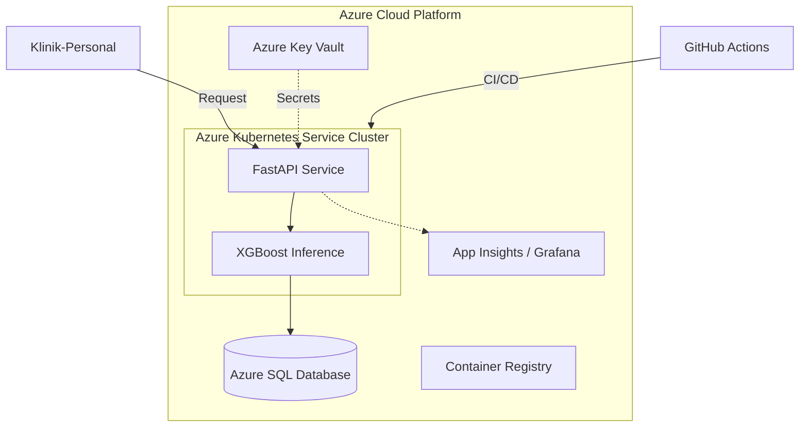

# Masterarbeit: Cloud-basierte MLOps-Plattform zur Sepsis-Früherkennung

[](https://www.python.org/)
[](https://azure.microsoft.com/)
[](https://www.docker.com/)
[](LICENSE)

> **Thema**: Cloud-basierte prädiktive Analytik für Sepsis-Früherkennung  
> **Autor**: Mustafa Demir  
> **Zeitraum**: Januar 2026 - Mai 2026  
> **Status**: In Bearbeitung 🏗️

---

## 📖 Inhaltsverzeichnis
- [📋 Projektübersicht](#-projektübersicht)
- [🏗️ Architektur](#️-architektur)
- [🛠️ Technologie-Stack](#-technologie-stack)
- [📁 Projektstruktur](#-projektstruktur)
- [🚀 Quick Start](#-quick-start)
- [📊 Datensatz](#-datensatz)
- [🧪 Machine Learning Pipeline](#-machine-learning-pipeline)
- [☁️ Cloud-Deployment](#-cloud-deployment)
- [🔒 Security & Compliance](#-security--compliance)
- [📈 Monitoring & Observability](#-monitoring--observability)
- [📚 Zitierung](#-zitierung)

---

## 📋 Projektübersicht

Dieses Projekt entwickelt eine **produktionsreife MLOps-Plattform** zur Früherkennung von Sepsis in Krankenhäusern. Die Lösung kombiniert maschinelles Lernen mit moderner Cloud-Architektur, um medizinischem Personal eine frühzeitige Warnung zu ermöglichen.

### 🎯 Projektziele
1. **Medizinischer Impact**: Sepsis-Risiko 6-12 Stunden vor klinischen Symptomen vorhersagen.
2. **Technische Exzellenz**: Aufbau einer skalierbaren und wartbaren Cloud-Infrastruktur auf Azure.
3. **Akademischer Beitrag**: Evaluation von MLOps-Praktiken in regulierten Healthcare-Umgebungen.

### 🔬 Forschungsfragen
- Wie kann eine Cloud-native Architektur die Inferenz-Latenz kritischer Sepsis-Vorhersagen in Echtzeit-Umgebungen minimieren?
- Inwieweit unterstützen automatisierte MLOps-Workflows die Einhaltung regulatorischer Anforderungen (DSGVO, MDR)?
- Welche Strategien für kontinuierliches Retraining sind effektiv, um Model-Drift bei klinischen Zeitreihendaten zu begegnen?

---

## 🏗️ Architektur



---

## 🛠️ Technologie-Stack

| Kategorie | Technologie | Zweck |
|-----------|-------------|-------|
| **ML Framework** | Scikit-Learn, XGBoost | Modelltraining & Inferenz |
| **API** | FastAPI, Uvicorn | REST-Endpunkte für Vorhersagen |
| **Datenbank** | Azure SQL Database | Persistierung von Patientendaten |
| **Container** | Docker, ACR | Containerisierung & Registry |
| **Orchestration** | AKS | Cluster-Management & Scaling |
| **IaC** | Bicep, Terraform | Infrastructure as Code |
| **CI/CD** | GitHub Actions | Automatisierte Build- & Deploy-Pipelines |

---

## 📁 Projektstruktur

```text
.
├── .github/workflows/       # CI/CD Pipelines
├── config/                  # Modell- & Deployment-Konfigurationen
├── data/                    # Rohdaten & Preprocessing-Skripte
├── docker/                  # Dockerfiles für API und Training
├── docs/                    # Thesis (LaTeX) & API-Dokumentation
├── infrastructure/          # IaC Templates (Bicep/K8s)
├── notebooks/               # EDA & Experimente
├── src/                     # Produktionscode (API, Model, Utils)
├── tests/                   # Unit- & Integrationstests
├── requirements.txt         # Abhängigkeiten
└── README.md                # Dokumentation
```

---

## 🚀 Quick Start

### 1. Repository klonen
```bash
git clone https://github.com/MustDemir/Masterarbeit-Cloud-MLOps.git
cd Masterarbeit-Cloud-MLOps
```

### 2. Setup & Umgebung
```bash
python3 -m venv venv
source venv/bin/activate  # Windows: venv\Scripts\activate
pip install -r requirements.txt
```

### 3. Umgebungsvariablen
Erstelle eine `.env` Datei basierend auf `.env.example`:
```bash
cp .env.example .env
# Füge deine Azure Credentials und DB-Strings hinzu
```

### 4. Lokal starten
```bash
uvicorn src.api.main:app --reload
```
Besuche [localhost:8000/docs](http://localhost:8000/docs) für die API-Dokumentation.

---

## 📊 Datensatz

Das Modell wird primär mit der **MIMIC-III Clinical Database** trainiert.
- **Features**: Herzfrequenz (HR), Temperatur, Blutdruck (MAP), Laktatwert, etc.
- **Label**: Binärer Sepsis-Status (0/1).

---

## 🧪 Machine Learning Pipeline

1. **Preprocessing**: Imputation fehlender Werte (KNN) & Skalierung.
2. **Feature Engineering**: Berechnung des SOFA-Scores und zeitlicher Trends.
3. **Training**: XGBoost mit Hyperparameter-Optimierung.
4. **Monitoring**: Überwachung von Model-Accuracy und Prediction-Latency via Grafana.

---

## 🔒 Security & Compliance

- **DSGVO**: Alle Patientendaten werden pseudonymisiert verarbeitet.
- **Security**: Verschlüsselung at-rest (TDE) und in-transit (TLS 1.3). Secrets werden ausschließlich im **Azure Key Vault** verwaltet.

---

## 📚 Zitierung

Falls dieses Projekt für akademische Zwecke genutzt wird, bitte wie folgt zitieren:

```bibtex
@mastersthesis{demir2026sepsis,
  author = {Mustafa Demir},
  title = {Cloud-basierte prädiktive Analytik für Sepsis-Früherkennung},
  school = {Deine Hochschule},
  year = {2026},
  url = {https://github.com/MustDemir/Masterarbeit-Cloud-MLOps}
}
```

---

## 🤝 Kontakt

**Mustafa Demir**  
📧 Email: mustafa.demir@example.com  
🐙 GitHub: [MustDemir](https://github.com/MustDemir)

---

**⭐ Wenn dir dieses Projekt gefällt, gib ihm einen Star auf GitHub!**

---

**Letzte Aktualisierung**: 26. Januar 2026
